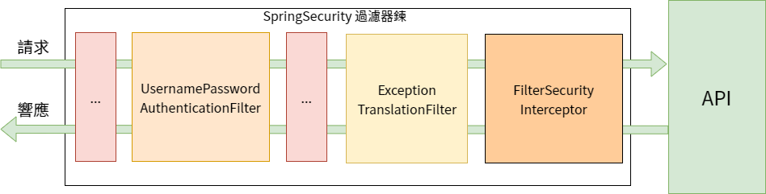

# Spring Security 從入門到精通

## 課程介紹

## 0、簡介

## 1、快速入門

### 1.1、準備工作

1. 設置父工程、添加依賴

   ```xml
       <parent>
           <groupId>org.springframework.boot</groupId>
           <artifactId>spring-boot-starter-parent</artifactId>
           <version>2.6.3</version>
       </parent>
   
       <!-- https://mvnrepository.com/artifact/org.springframework.boot/spring-boot-starter-web -->
       <dependency>
           <groupId>org.springframework.boot</groupId>
           <artifactId>spring-boot-starter-web</artifactId>
       </dependency>
       <!-- https://mvnrepository.com/artifact/org.projectlombok/lombok -->
       <dependency>
           <groupId>org.projectlombok</groupId>
           <artifactId>lombok</artifactId>
           <scope>provided</scope>
           <optional>true</optional>
       </dependency>
   ```

   

2. 創建啟動類

   ```java
   @SpringBootApplication
   public class BootApplication {
   	public static void main(String[] args) {
   		SpringApplication.run(BootApplication.class, args);
   	}
   }
   ```

   

3. 創建 Controller

   ```java
   @RestController
   public class HelloController {
   
   	@GetMapping("hello")
   	public String hello() {
   		return "hello";
   	}
   }
   ```

   

### 1.2、引入 Spring Security


```xml
        <dependency>
            <groupId>org.springframework.boot</groupId>
            <artifactId>spring-boot-starter-security</artifactId>
        </dependency>
```


## 2、認證

### 2.1、登入校驗流程

### 2.2、原理初探

#### 2.2.1 SpringSecurity完整流程





### 2.3、解決問題

#### 2.3.1、思路分析

登入

1. 自定義登入接口
   - 生成 JWT
   - 把用戶信息存入 redis 中
2. 自定義 UserDetailService

校驗

1. 定義 JWT 認證過濾器
   - 獲取 token
   - 解析 token 獲取其中的 userId
   - 從 redis 中獲取用戶信息
   - 存入 SecurityContextHolder


#### 2.3.2、準備工作

1. 添加依賴

   ```xml
           <!-- https://mvnrepository.com/artifact/org.springframework.boot/spring-boot-starter-data-redis -->
           <dependency>
               <groupId>org.springframework.boot</groupId>
               <artifactId>spring-boot-starter-data-redis</artifactId>
           </dependency>
           <!-- https://mvnrepository.com/artifact/com.alibaba/fastjson -->
           <dependency>
               <groupId>com.alibaba</groupId>
               <artifactId>fastjson</artifactId>
               <version>1.2.79</version>
           </dependency>
           <!-- https://mvnrepository.com/artifact/io.jsonwebtoken/jjwt -->
           <dependency>
               <groupId>io.jsonwebtoken</groupId>
               <artifactId>jjwt</artifactId>
               <version>0.9.1</version>
           </dependency>
   ```

   

2. 添加 redis 相關配置

   ```java
   package com.example.utils;
   
   import com.alibaba.fastjson.JSON;
   import com.alibaba.fastjson.parser.ParserConfig;
   import com.alibaba.fastjson.serializer.SerializerFeature;
   import com.fasterxml.jackson.databind.JavaType;
   import com.fasterxml.jackson.databind.type.TypeFactory;
   import org.springframework.data.redis.serializer.RedisSerializer;
   import org.springframework.data.redis.serializer.SerializationException;
   
   import java.nio.charset.Charset;
   
   /**
    * Redis 使用 FastJson 序列化
    */
   public class FastJsonRedisSerializer<T> implements RedisSerializer<T> {
   
   	public static final Charset DEFAULT_CHARSET = Charset.forName("UTF-8");
   
   	private Class<T> clazz;
   
   	static {
   		ParserConfig.getGlobalInstance().setAutoTypeSupport(true);
   	}
   
   	public FastJsonRedisSerializer(Class<T> clazz) {
   		super();
   		this.clazz = clazz;
   	}
   
   	@Override
   	public byte[] serialize(T t) throws SerializationException {
   		if (t == null) {
   			return new byte[0];
   		}
   		return JSON.toJSONString(t, SerializerFeature.WriteClassName).getBytes(DEFAULT_CHARSET);
   	}
   
   	@Override
   	public T deserialize(byte[] bytes) throws SerializationException {
   		if (bytes == null || bytes.length <= 0) {
   			return null;
   		}
   		String str = new String(bytes, DEFAULT_CHARSET);
   		return (T) JSON.parseObject(str, clazz);
   	}
   
   	protected JavaType getJavaType(Class<?> clazz) {
   		return TypeFactory.defaultInstance().constructArrayType(clazz);
   	}
   }
   ```

   ```java
   package com.example.config;
   
   import com.alibaba.fastjson.parser.ParserConfig;
   import com.example.utils.FastJsonRedisSerializer;
   import org.springframework.context.annotation.Bean;
   import org.springframework.context.annotation.Configuration;
   import org.springframework.data.redis.connection.RedisConnectionFactory;
   import org.springframework.data.redis.core.RedisTemplate;
   import org.springframework.data.redis.serializer.StringRedisSerializer;
   
   @Configuration
   public class RedisConfig {
   
   	/**
   	 * 重寫Redis序列化方式，使用Json方式:
   	 * 當我們的數據存儲到Redis的時候，我們的鍵（key）和值（value）都是通過Spring提供的Serializer序列化到數據庫的。RedisTemplate默認使用的是JdkSerializationRedisSerializer，StringRedisTemplate默認使用的是StringRedisSerializer。
   	 * Spring Data JPA為我們提供了下面的Serializer：
   	 * GenericToStringSerializer、Jackson2JsonRedisSerializer、JacksonJsonRedisSerializer、JdkSerializationRedisSerializer、OxmSerializer、StringRedisSerializer。
   	 * 在此我們將自己配置RedisTemplate並定義Serializer。
   	 *
   	 * @param redisConnectionFactory
   	 * @return
   	 */
   	@Bean
   	public RedisTemplate<String, Object> redisTemplate(RedisConnectionFactory redisConnectionFactory) {
   		RedisTemplate<String, Object> redisTemplate = new RedisTemplate<>();
   		redisTemplate.setConnectionFactory(redisConnectionFactory);
   
   		FastJsonRedisSerializer<Object> fastJsonRedisSerializer = new FastJsonRedisSerializer<>(Object.class);
   		// 全局開啟AutoType，不建議使用
   		// ParserConfig.getGlobalInstance().setAutoTypeSupport(true);
   		// 建議使用這種方式，小範圍指定白名單
   		ParserConfig.getGlobalInstance().addAccept("com.example.");
   
   		// 設置值（value）的序列化採用FastJsonRedisSerializer。
   		redisTemplate.setValueSerializer(fastJsonRedisSerializer);
   		redisTemplate.setHashValueSerializer(fastJsonRedisSerializer);
   		// 設置鍵（key）的序列化採用StringRedisSerializer。
   		redisTemplate.setKeySerializer(new StringRedisSerializer());
   		redisTemplate.setHashKeySerializer(new StringRedisSerializer());
   
   		redisTemplate.afterPropertiesSet();
   		return redisTemplate;
   	}
   }
   ```

   ref: https://www.jianshu.com/p/23f2c4c92093

3. 響應類

   ```java
   package com.example.domain;
   
   import com.fasterxml.jackson.annotation.JsonInclude;
   import lombok.AllArgsConstructor;
   import lombok.Data;
   import lombok.NoArgsConstructor;
   
   @Data
   @NoArgsConstructor
   @AllArgsConstructor
   @JsonInclude(JsonInclude.Include.NON_NULL)
   public class ResponseResult<T> {
   	/** 狀態碼。 */
   	private Integer code;
   	/** 提示信息。 如果有錯誤，前端可以獲取該字段進行提示 */
   	private String msg;
   	/** 查詢到的結果數據。 */
   	private T data;
   
   	public ResponseResult(Integer code, String msg) {
   		this.code = code;
   		this.msg = msg;
   	}
   
   	public ResponseResult(Integer code, T data) {
   		this.code = code;
   		this.data = data;
   	}
   }
   ```

   

4. 工具類

   ```java
   package com.example.util;
   
   import io.jsonwebtoken.Claims;
   import io.jsonwebtoken.JwtBuilder;
   import io.jsonwebtoken.Jwts;
   import io.jsonwebtoken.SignatureAlgorithm;
   
   import javax.crypto.SecretKey;
   import javax.crypto.spec.SecretKeySpec;
   import java.util.Base64;
   import java.util.Date;
   import java.util.UUID;
   
   /**
    * JWT 工具類。
    */
   public class JwtUtils {
   	/** 有效期: 60 * 60 * 1000 = 1 小時 */
   	public static final Long JWT_TTL = 60 * 60 * 1000L;
   	/** 設置密鑰明文 */
   	public static final String JWT_KEY = "sangeng";
   
   	public static String getUUID() {
   		return UUID.randomUUID().toString().replaceAll("-", "");
   	}
   
   	/**
   	 * 生成 JWT
   	 * @param subject token 中要存放的數據 (JSON 格式)
   	 * @return
   	 */
   	public static String createJWT(String subject) {
   		// 設置過期時間
   		JwtBuilder builder = getJwtBuilder(subject, null, getUUID());
   		return builder.compact();
   	}
   
   	/**
   	 * 生成 JWT
   	 * @param subject token 中要存放的數據 (JSON 格式)
   	 * @param ttlMillis token 超過時間
   	 * @return
   	 */
   	public static String createJWT(String subject, Long ttlMillis) {
   		// 設置過期時間
   		JwtBuilder builder = getJwtBuilder(subject, ttlMillis, getUUID());
   		return builder.compact();
   	}
   
   	public static String createJWT(String id, String subject, Long ttlMillis) {
   		// 設置過期時間
   		JwtBuilder builder = getJwtBuilder(subject, ttlMillis, id);
   		return builder.compact();
   	}
   
   	private static JwtBuilder getJwtBuilder(String subject, Long ttlMillis, String uuid) {
   		SignatureAlgorithm signatureAlgorithm = SignatureAlgorithm.HS256;
   		SecretKey secretKey = generateSecretKey();
   		long nowMillis = System.currentTimeMillis();
   		Date now = new Date(nowMillis);
   
   		if (ttlMillis == null) {
   			ttlMillis = JWT_TTL;
   		}
   
   		long expMillis = nowMillis + ttlMillis;
   		Date expDate = new Date(expMillis);
   
   		return Jwts.builder()
   				.setId(uuid)
   				.setSubject(subject)
   				.setIssuer("sg")
   				.setIssuedAt(now)
   				.signWith(signatureAlgorithm, secretKey)
   				.setExpiration(expDate);
   	}
   
   	/**
   	 * 生成加密後的密鑰 SecretKey
   	 */
   	private static SecretKey generateSecretKey() {
   		byte[] encodeKey = Base64.getDecoder().decode(JWT_KEY);
   		SecretKey key = new SecretKeySpec(encodeKey, 0, encodeKey.length, "AES");
   		return key;
   	}
   
   	/**
   	 * 解析 JWT
   	 * @param jwt
   	 */
   	public static Claims parseJWT(String jwt) {
   		SecretKey secretKey = generateSecretKey();
   		return Jwts.parser().setSigningKey(secretKey)
   				.parseClaimsJws(jwt)
   				.getBody();
   	}
   }
   ```

   ```java
   package com.example.helper;
   
   import org.springframework.beans.factory.annotation.Autowired;
   import org.springframework.data.redis.core.BoundSetOperations;
   import org.springframework.data.redis.core.HashOperations;
   import org.springframework.data.redis.core.RedisTemplate;
   import org.springframework.data.redis.core.ValueOperations;
   import org.springframework.stereotype.Component;
   
   import java.util.*;
   import java.util.concurrent.TimeUnit;
   
   @Component
   public class RedisCache {
   	@Autowired
   	private RedisTemplate redisTemplate;
   
   	/**
   	 * 緩存基本的對象。 (Integer、String、實體類等)
   	 *
   	 * @param key 緩存的鍵值
   	 * @param value 緩存的值
   	 */
   	public <T> void setCacheObject(final String key, final T value) {
   		redisTemplate.opsForValue().set(key, value);
   	}
   
   	/**
   	 * 緩存基本的對象。 (Integer、String、實體類等)
   	 *
   	 * @param key 緩存的鍵值
   	 * @param value 緩存的值
   	 * @param timeout 時間
   	 * @param timeUnit 時間顆粒度
   	 */
   	public <T> void setCacheObject(final String key, final T value,
   								   final Integer timeout, final TimeUnit timeUnit) {
   		redisTemplate.opsForValue().set(key, value, timeout, timeUnit);
   	}
   
   	/**
   	 * 設置有效時間
   	 * @param key Redis鍵
   	 * @param timeout 超時時間
   	 * @param timeUnit 時間單位
   	 * @return ture=設置成功；false=設置失敗
   	 */
   	public boolean expire(final String key, final long timeout, final TimeUnit timeUnit) {
   		return redisTemplate.expire(key, timeout, timeUnit);
   	}
   
   	/**
   	 * 獲得緩存的基本對象
   	 *
   	 * @param key 緩存鍵值
   	 * @return 緩存鍵值對應的數據
   	 */
   	public <T> T getCacheObject(final String key) {
   		ValueOperations<String, T> operations = redisTemplate.opsForValue();
   		return operations.get(key);
   	}
   
   	/**
   	 * 刪除單個對象
   	 *
   	 * @param key
   	 */
   	public boolean deleteObject(final String key) {
   		return redisTemplate.delete(key);
   	}
   
   	/**
   	 * 刪除集合對象
   	 *
   	 * @param collection 多個對象
   	 * @return
   	 */
   	public long deleteObject(final Collection collection) {
   		return redisTemplate.delete(collection);
   	}
   
   	/**
   	 * 緩存 List 數據
   	 *
   	 * @param key 緩存的鍵值
   	 * @param dataList 待緩存的 List 數據
   	 * @return 緩存的對象
   	 */
   	public <T> long setCacheList(final String key, final List<T> dataList) {
   		Long count = redisTemplate.opsForList().rightPushAll(key, dataList);
   		return count == null ? 0 : count;
   	}
   
   	/**
   	 * 獲得緩存 List 對象
   	 *
   	 * @param key 緩存的鍵值
   	 * @return 緩存鍵值對應的數據
   	 */
   	public <T> List<T> getCacheList(final String key) {
   		return redisTemplate.opsForList().range(key, 0, -1);
   	}
   
   	/**
   	 * 緩存 List 數據
   	 *
   	 * @param key 緩存的鍵值
   	 * @param dataSet 待緩存的數據
   	 * @return 緩存數據的對象
   	 */
   	public <T> BoundSetOperations<String, T> setCacheList(final String key, final Set<T> dataSet) {
   		BoundSetOperations operations = redisTemplate.boundSetOps(key);
   
   		Iterator<T> it = dataSet.iterator();
   		while (it.hasNext()) {
   			operations.add(it.next());
   		}
   
   		return operations;
   	}
   
   	/**
   	 * 獲得緩存 Set
   	 *
   	 * @param key 緩存的鍵值
   	 * @return 緩存鍵值對應的數據
   	 */
   	public <T> Set<T> getCacheSet(final String key) {
   		return redisTemplate.opsForSet().members(key);
   	}
   
   	/**
   	 * 緩存 Map
   	 *
   	 * @param key 緩存的鍵值
   	 * @param dataMap 待緩存的 Map 數據
   	 * @return 緩存的對象
   	 */
   	public <T> void setCacheMap(final String key, final Map<String, T> dataMap) {
   		if (dataMap != null) {
   			redisTemplate.opsForHash().putAll(key, dataMap);
   		}
   	}
   
   	/**
   	 * 獲得緩存 Map
   	 *
   	 * @param key 緩存的鍵值
   	 * @return 緩存鍵值對應的數據
   	 */
   	public <T> Map<String, T> getCacheMap(final String key) {
   		return redisTemplate.opsForHash().entries(key);
   	}
   
   	/**
   	 * 往 Hash 中存入數據
   	 *
   	 * @param key Redis鍵
   	 * @param hKey Hash鍵
   	 * @return 緩存的對象
   	 */
   	public <T> void setCacheMap(final String key, final String hKey, final T value) {
   		redisTemplate.opsForHash().put(key, hKey, value);
   	}
   
   	/**
   	 * 獲取 Hash 中的數據
   	 *
   	 * @param key Redis鍵
   	 * @param hKey Hash鍵
   	 * @return Hash 中的對象
   	 */
   	public <T> T getCacheMap(final String key, final String hKey) {
   		HashOperations<String, String, T> operations = redisTemplate.opsForHash();
   		return operations.get(key, hKey);
   	}
   
   	/**
   	 * 刪除 Hash 中的數據
   	 *
   	 * @param key Redis鍵
   	 * @param hKey Hash鍵
   	 */
   	public void deleteCacheMapValue(final String key, final String hKey) {
   		HashOperations<String, String, ?> operations = redisTemplate.opsForHash();
   		operations.delete(key, hKey);
   	}
   
   	/**
   	 * 獲得多個 Hash 中的數據
   	 *
   	 * @param key Redis鍵
   	 * @param hKeys Hash鍵集合
   	 * @return Hash對象集合
   	 */
   	public <T> List<T> getCacheMap(final String key, final Collection<Objects> hKeys) {
   		return redisTemplate.opsForHash().multiGet(key, hKeys);
   	}
   
   	/**
   	 * 獲取緩存的基本對象列表
   	 *
   	 * @param pattern 字串前綴
   	 * @return 對象列表
   	 */
   	public Collection<String> keys(final String pattern) {
   		return redisTemplate.keys(pattern);
   	}
   }
   ```

   ```java
   package com.example.util;
   
   import javax.servlet.http.HttpServletResponse;
   import java.io.IOException;
   
   public class WebUtils {
   
   	/**
   	 * 將字串渲染到客戶端。 TODO: 怪
   	 * @param response 渲染對象
   	 * @param string 待渲染的字串
   	 *
   	 * @return null
   	 */
   	public static String renderString(HttpServletResponse response, String string) {
   
   		try {
   			response.setStatus(200);
   			response.setContentType("application/json");
   			response.setCharacterEncoding("utf-8");
   			response.getWriter().print(string);
   		} catch (IOException e) {
   			e.printStackTrace();
   		}
   
   		return null;
   	}
   }
   ```

   

5. 實體類

   ```java
   package com.example.domain;
   
   import lombok.AllArgsConstructor;
   import lombok.Data;
   import lombok.NoArgsConstructor;
   
   import java.io.Serializable;
   import java.util.Date;
   
   @Data
   @NoArgsConstructor
   @AllArgsConstructor
   public class User implements Serializable {
   
   	/**
   	 * 主鍵
   	 */
   	private Long id;
   
   	/**
   	 * 用戶名
   	 */
   	private String userName;
   
   	/**
   	 * 暱稱
   	 */
   	private String nickName;
   
   	/**
   	 * 密碼
   	 */
   	private String password;
   
   	/**
   	 * 帳號狀態 (0: 正常、1: 停用)
   	 */
   	private String status;
   
   	/**
   	 * 信箱
   	 */
   	private String email;
   
   	/**
   	 * 手機
   	 */
   	private String phoneNumber;
   
   	/**
   	 * 性別 (0:男、1:女、2:未知)
   	 */
   	private String sex;
   
   	/**
   	 * 頭像
   	 */
   	private String avatar;
   
   	/**
   	 * 用戶類型 (0:管理員、1:普通用戶)
   	 */
   	private String userType;
   
   	/**
   	 * 創建人的用戶 ID
   	 */
   	private Long createBy;
   
   	/**
   	 * 創建時間
   	 */
   	private Date createTime;
   
   	/**
   	 * 更新人
   	 */
   	private Long updateBy;
   
   	/**
   	 * 更新時間
   	 */
   	private Date updateTime;
   
   	/**
   	 * 刪除標誌 (0:未刪除；1:已刪除)
   	 */
   	private Integer delFlag;
   }
   ```

   

#### 2.3.3、實現

##### 2.3.3.1、數據庫校驗用戶


###### 準備工作

創建用戶表

```sql
CREATE SCHEMA `spring-security_sangeng` DEFAULT CHARACTER SET utf8mb4;

--
-- USER
--
CREATE TABLE sys_user (
	id BIGINT(20) NOT NULL AUTO_INCREMENT COMMENT '主鍵',
	user_name VARCHAR(64) NOT NULL COMMENT '名稱',
	nick_name VARCHAR(64) NOT NULL COMMENT '暱稱',
	password VARCHAR(64) NOT NULL COMMENT '密碼',
	status CHAR(1) NOT NULL DEFAULT '0' COMMENT '帳號狀態 (0:正常、1:停用)',
	email VARCHAR(64) COMMENT '信箱',
	phone_number VARCHAR(32) COMMENT '手機',
	sex CHAR(1) COMMENT '性別 (0:男、1:女、2:未知)',
	avatar VARCHAR(128) NOT NULL COMMENT '頭像',
	user_type CHAR(1) NOT NULL DEFAULT '1' NOT NULL COMMENT '用戶類型 (0:管理員、1:普通用戶)',
	create_by BIGINT(20) NOT NULL COMMENT '創建人的用戶 ID',
	create_time DATETIME NOT NULL COMMENT '創建時間',
	update_by BIGINT(20) NOT NULL COMMENT '更新人',
	update_time DATETIME NOT NULL COMMENT '更新時間',
	del_flag INT(11) DEFAULT '0' COMMENT '刪除標誌 (0:未刪除、1:已刪除)',

	PRIMARY KEY (id)
)
COMMENT = '用戶表';
```

引入依賴(mybatis-plus、mysql驅動)

```xml
        <!-- https://mvnrepository.com/artifact/com.baomidou/mybatis-plus-boot-starter -->
        <dependency>
            <groupId>com.baomidou</groupId>
            <artifactId>mybatis-plus-boot-starter</artifactId>
            <version>3.5.1</version>
        </dependency>
        <!-- https://mvnrepository.com/artifact/mysql/mysql-connector-java -->
        <dependency>
            <groupId>mysql</groupId>
            <artifactId>mysql-connector-java</artifactId>
        </dependency>
```

配置數據庫信息 (application.yml)

```yaml
spring:
  datasource:
    url: jdbc:mysql://localhost:3306/spring-security_sangeng?characterEncoding=utf-8&serverTimezone=UTC
    username: root
    password: P@ssw0rd
    driver-class-name: com.mysql.cj.jdbc.Driver
```

定義 Mapper 接口

```java
package com.example.mapper;

import com.baomidou.mybatisplus.core.mapper.BaseMapper;
import com.example.domain.User;

public interface UserMapper extends BaseMapper<User> {
	
}
```

修改 User 實體類 (類名上加 `@TableName("sys_user")`，id 字段上加`@TableId`)

```java
...

@TableName("sys_user")
public class User implements Serializable {

	/**
	 * 主鍵
	 */
	@TableId
	private Long id;
    
...
```

配置 Mapper 掃描 (加上 `@MapperScan("com.example.mapper")`)

```java
package com.example;

import org.mybatis.spring.annotation.MapperScan;
import org.springframework.boot.SpringApplication;
import org.springframework.boot.autoconfigure.SpringBootApplication;

/**
 * SpringBoot 啟動類。
 */
@MapperScan("com.example.mapper")
@SpringBootApplication
public class BootApplication {
	public static void main(String[] args) {
		SpringApplication.run(BootApplication.class, args);
	}
}
```

添加 Junit 依賴

```xml
        <!-- https://mvnrepository.com/artifact/org.springframework.boot/spring-boot-starter-test -->
        <dependency>
            <groupId>org.springframework.boot</groupId>
            <artifactId>spring-boot-starter-test</artifactId>
            <scope>test</scope>
        </dependency>
```

測試 MP 能否正常使用

```java
package com.example;

import com.example.domain.User;
import com.example.mapper.UserMapper;
import org.junit.jupiter.api.Test;
import org.springframework.beans.factory.annotation.Autowired;
import org.springframework.boot.test.context.SpringBootTest;

import java.util.List;

@SpringBootTest
public class MapperTest {

	@Autowired
	private UserMapper userMapper;

	@Test
	public void testUserMapper() {
		List<User> users = userMapper.selectList(null);
		System.out.println(users);
	}
}
```


###### 核心代碼實現


```java
package com.example.service;

import com.baomidou.mybatisplus.core.conditions.query.LambdaQueryWrapper;
import com.example.domain.LoginUser;
import com.example.domain.User;
import com.example.mapper.UserMapper;
import org.springframework.beans.factory.annotation.Autowired;
import org.springframework.security.core.userdetails.UserDetails;
import org.springframework.security.core.userdetails.UserDetailsService;
import org.springframework.security.core.userdetails.UsernameNotFoundException;
import org.springframework.stereotype.Service;

import java.util.Objects;

@Service
public class UserDetailServiceImpl implements UserDetailsService {
	@Autowired
	private UserMapper userMapper;

	@Override
	public UserDetails loadUserByUsername(String username) throws UsernameNotFoundException {
		// 查詢用戶信息
		LambdaQueryWrapper<User> queryWrapper = new LambdaQueryWrapper<>();
		queryWrapper.eq(User::getUserName, username);
		User user = userMapper.selectOne(queryWrapper);

		// 如果沒有查詢到用戶，就拋出異常
		if (Objects.isNull(user)) {
			// ExceptionTranslationFilter 會捕獲到例外，即便沒有我們也可以自定義全局異常處理
			throw new RuntimeException("用戶名或密碼錯誤");
		}

		// TODO: 查詢對應的權限信息 (屬於授權部分，後段課程說明)

		// 把數據封裝成 UserDetails 返回 (UserDetails 是接口，需要對應的實現類)
		return new LoginUser(user);
	}
}
```


```java
package com.example.domain;

import lombok.AllArgsConstructor;
import lombok.Data;
import lombok.NoArgsConstructor;
import org.springframework.security.core.GrantedAuthority;
import org.springframework.security.core.userdetails.UserDetails;

import java.util.Collection;

@Data
@NoArgsConstructor
@AllArgsConstructor
public class LoginUser implements UserDetails {

	private User user;

	@Override
	public Collection<? extends GrantedAuthority> getAuthorities() {
		// 目前尚不需權限信息
		return null;
	}

	@Override
	public String getPassword() {
		return user.getPassword();
	}

	@Override
	public String getUsername() {
		return user.getUserName();
	}

	// TODO: 下面都先暫設成 true 避免相關認證失敗無法登入

	@Override
	public boolean isAccountNonExpired() {
		return true;
	}

	@Override
	public boolean isAccountNonLocked() {
		return true;
	}

	@Override
	public boolean isCredentialsNonExpired() {
		return true;
	}

	@Override
	public boolean isEnabled() {
		return true;
	}
}
```


默認的 PasswordEncoder 需要在密碼前加上 `{加密類型}`

```
java.lang.IllegalArgumentException: There is no PasswordEncoder mapped for the id "null"
```

若密碼為明文儲存，需要在實際密碼前帶有`{noop}`

例如 原密碼欄位 `1234` -> 改成 `{noop}1234`


##### 2.3.3.2、密碼加密儲存


> 密碼明文儲存的話，如果數據庫密碼洩漏，那所有用戶的密碼也就洩漏了。


一般使用 SpringSecurity 提供的 BCryptPasswordEncoder

只要把 PasswordEncoder 對象注入到 Spring 容器中，SpringSecurity 就會使用它來進行密碼校驗

SpringSecurity 要求這個配置類要繼承 WebSecurityConfigurerAdapter

```java
package com.example.config;

import org.springframework.context.annotation.Bean;
import org.springframework.context.annotation.Configuration;
import org.springframework.security.config.annotation.web.configuration.WebSecurityConfigurerAdapter;
import org.springframework.security.crypto.bcrypt.BCryptPasswordEncoder;
import org.springframework.security.crypto.password.PasswordEncoder;

@Configuration
public class SecurityConfig extends WebSecurityConfigurerAdapter {

	@Bean
	public PasswordEncoder passwordEncoder() {
		return new BCryptPasswordEncoder();
	}
}
```


TODO: DB 存 {noop}1234，登入頁密碼輸 1234 顯示 憑證錯誤

```java
2022-02-13 00:48:08.714  WARN 2680 --- [nio-8080-exec-2] o.s.s.c.bcrypt.BCryptPasswordEncoder     : Encoded password does not look like BCrypt
```


##### 2.3.3.3、登入接口

必須讓 Spring Security **放行**登入接口

將 AuthenticationManager 注入容器，使用 authenticate 方法進行用戶認證

認證成功後生成 JWT 放到 response 後返回前端

將用戶信息存入 redis (以用戶 id 作為 key)


```java
package com.example.controller;

import com.example.domain.ResponseResult;
import com.example.domain.User;
import com.example.service.LoginService;
import org.springframework.beans.factory.annotation.Autowired;
import org.springframework.web.bind.annotation.PostMapping;
import org.springframework.web.bind.annotation.RequestBody;
import org.springframework.web.bind.annotation.ResponseBody;
import org.springframework.web.bind.annotation.RestController;

@RestController
public class LoginController {

	@Autowired
	private LoginService loginService;

	@PostMapping("/user/login")
	public ResponseResult login(@RequestBody User user) {
		// 登入
		return loginService.login(user);
	}
}
```


```java
package com.example.config;

import org.springframework.context.annotation.Bean;
import org.springframework.context.annotation.Configuration;
import org.springframework.security.authentication.AuthenticationManager;
import org.springframework.security.config.annotation.web.builders.HttpSecurity;
import org.springframework.security.config.annotation.web.configuration.WebSecurityConfigurerAdapter;
import org.springframework.security.config.http.SessionCreationPolicy;
import org.springframework.security.crypto.bcrypt.BCryptPasswordEncoder;
import org.springframework.security.crypto.password.PasswordEncoder;

/**
 * SpringSecurity 要求 SecurityConfig 這個配置類要繼承 WebSecurityConfigurerAdapter
 * 可以重寫裡面的一些方法來實現相關的功能
 */
@Configuration
public class SecurityConfig extends WebSecurityConfigurerAdapter {

	/**
	 * 創建 BCryptPasswordEncoder 注入容器
	 */
	@Bean
	public PasswordEncoder passwordEncoder() {
		return new BCryptPasswordEncoder();
	}

	/**
	 * 前後端分離架構下 放行登入接口 的 配置
	 *
	 * @throws Exception
	 */
	@Override
	protected void configure(HttpSecurity http) throws Exception {
		http
				// 關閉 CSRF
				.csrf().disable()
				// 不通過 Session 獲取 SecurityContext
				.sessionManagement().sessionCreationPolicy(SessionCreationPolicy.STATELESS)
				.and()
				.authorizeRequests()
				// 對於登入接口，允許匿名訪問
				.antMatchers("/user/login").anonymous()
				// 除上面外的所有請求，全部都需要鑒權(authentication)認證
				.anyRequest().authenticated();
	}

	// IDE generate override methods, then choose `authenticationManagerBean`
	// Idea alt + insert
	// 透過繼承此方法並加上 @Bean 可暴露(expose) 到容器當中，就可以獲取到 AuthenticationManager 了 (其他 Class 可以 @Autowired)
	@Bean
	@Override
	public AuthenticationManager authenticationManagerBean() throws Exception {
		return super.authenticationManagerBean();
	}
}
```


```java
package com.example.service;

import com.example.domain.ResponseResult;
import com.example.domain.User;

public interface LoginService {
	ResponseResult login(User user);
}
```


```java
package com.example.service.impl;

import com.example.domain.LoginUser;
import com.example.domain.ResponseResult;
import com.example.domain.User;
import com.example.helper.RedisCache;
import com.example.service.LoginService;
import com.example.util.JwtUtils;
import org.springframework.beans.factory.annotation.Autowired;
import org.springframework.security.authentication.AuthenticationManager;
import org.springframework.security.authentication.UsernamePasswordAuthenticationToken;
import org.springframework.security.core.Authentication;
import org.springframework.stereotype.Service;

import java.util.HashMap;
import java.util.Objects;

@Service
public class LoginServiceImpl implements LoginService {

	@Autowired
	private AuthenticationManager authenticationManager;
	@Autowired
	private RedisCache redisCache;

	@Override
	public ResponseResult login(User user) {
		// AuthenticationManager#authenticate 進行用戶認證

		// 參數是 Authentication 接口，需要創建實現類
		// Idea 按 ctrl + alt 找到我們要的實現類 UsernamePasswordAuthenticationToken
		UsernamePasswordAuthenticationToken authenticationToken = new UsernamePasswordAuthenticationToken(
				user.getUserName(), user.getPassword()
		);
		// ProviderManager 會調用 UserDetailServiceImpl#loadUserByUsername 去進行用戶校驗
		Authentication authenticate = authenticationManager.authenticate(authenticationToken);

		// 如果認證沒通過，給出對應的提示
		if (Objects.isNull(authenticate)) {
			throw new RuntimeException("登入失敗");
		}

		// 如果認證通過了，使用 userid 生成一個 JWT。 JWT 存入 ResponseResult 返回
		// 可使用斷點調試(debug)來查看 userid 在 Authentication 的哪一個屬性當中，再使用 getter 方法取得即可
		LoginUser loginUser = (LoginUser) authenticate.getPrincipal();
		Long userId = loginUser.getUser().getId();
		String jwt = JwtUtils.createJWT(userId.toString());
		// 將 ResponseResult#data 做成 key-value 的形式
		HashMap<String, String> map = new HashMap<>();
		map.put("token", jwt);

		// 把完整的用戶信息存入 redis (userid 作為 key)
		// 加上 login: 當作 key 的前綴
		redisCache.setCacheObject("login:" + userId, loginUser);

		return new ResponseResult(200, "登入成功", map);
	}
}
```


P.S. 需要先安裝並啟動 redis server，否則會報連線失敗錯誤

非本地預設端口(6379) 的話，要在 application.yml 配置 redis 端口號 (甚至帳號密碼等)

```
2022-02-13 16:12:34.290 ERROR 5600 --- [nio-8080-exec-1] o.a.c.c.C.[.[.[/].[dispatcherServlet]    : Servlet.service() for servlet [dispatcherServlet] in context with path [] threw exception [Request processing failed; nested exception is org.springframework.data.redis.RedisConnectionFailureException: Unable to connect to Redis; nested exception is io.lettuce.core.RedisConnectionException: Unable to connect to localhost:6379] with root cause

java.net.ConnectException: Connection refused: no further information
```


##### 2.3.3.4、認證過濾器


```java
package com.example.filter;

import com.example.domain.LoginUser;
import com.example.helper.RedisCache;
import com.example.util.JwtUtils;
import io.jsonwebtoken.Claims;
import org.springframework.beans.factory.annotation.Autowired;
import org.springframework.security.authentication.UsernamePasswordAuthenticationToken;
import org.springframework.security.core.context.SecurityContext;
import org.springframework.security.core.context.SecurityContextHolder;
import org.springframework.stereotype.Component;
import org.springframework.util.StringUtils;
import org.springframework.web.filter.OncePerRequestFilter;

import javax.servlet.FilterChain;
import javax.servlet.ServletException;
import javax.servlet.http.HttpServletRequest;
import javax.servlet.http.HttpServletResponse;
import java.io.IOException;
import java.util.Objects;

// Servlet 原生的 Filter 有可能導致一個請求將過濾器調用多次，
// 使用 Spring 提供的實現類 OncePerRequestFilter 可避免此問題 (保證一個請求只會經過這個過濾器一次)
@Component // 注入到 Spring 容器
public class JwtAuthenticationTokenFilter extends OncePerRequestFilter {

	@Autowired
	private RedisCache redisCache;

	@Override
	protected void doFilterInternal(HttpServletRequest request, HttpServletResponse response, FilterChain filterChain) throws ServletException, IOException {
		// 獲取 token
		String token = request.getHeader("token");
		if (!StringUtils.hasText(token)) {
			// 放行 (呼叫 doFilter 方法 -> 放行請求)
			// 連 token 都沒有的話談何解析? 所以放行，讓後面的過濾器去判斷用戶的認證狀態。認證不符自然也就會拋出異常
			filterChain.doFilter(request, response);
			// 如果不 return，filter chain 響應回來的時候就會執行到下方不須執行的 code
			return;
		}

		// 解析 token
		String userId;
		try {
			Claims claims = JwtUtils.parseJWT(token);
			userId = claims.getSubject();
		} catch (Exception e) {
			e.printStackTrace();
			throw new RuntimeException("token 非法");
		}

		// 從 redis 中獲取(完整)用戶信息
		String redisKey = "login:" + userId;
		LoginUser loginUser = redisCache.getCacheObject(redisKey); // 方法泛型會自動推測為 LoginUser 型別
		// 有可能 redis 中不存在用戶信息
		if (Objects.isNull(loginUser)) {
			// 因為登入接口已經把用戶信息存到 redis 中了，所以只有當用戶退出登入時才會讓 Cache 失效(找不到)
			// 因此這裡取不到應該拋出用戶未登入異常
			throw new RuntimeException("用戶未登入");
		}

		// 存入 SecurityContextHolder (因為後面的 Filter 都是從 SecurityContextHolder 取得用戶的認證狀態)
		SecurityContext context = SecurityContextHolder.getContext();
		// UsernamePasswordAuthenticationToken 構造函數有兩種， 參數x2 和 參數x3
		// 參數x3: 才會執行 super.setAuthenticated(true);
		// 因為現在已經可從 redis 中獲取到對應的對象，說明該用戶已認證過。
		// 所以將 authenticated 設置為 true 才能讓後面的過濾器知道已認證過
		// 註: 第三個參數 authorities 是權限信息 (目前還沒有) TODO: 獲取權限信息封裝到 Authentication 中
		UsernamePasswordAuthenticationToken authenticationToken =
				new UsernamePasswordAuthenticationToken(loginUser, null, null);
		context.setAuthentication(authenticationToken);

		// 放行
		filterChain.doFilter(request, response);
	}
}
```


配置 JwtAuthenticationTokenFilter

```java
package com.example.config;

import com.example.filter.JwtAuthenticationTokenFilter;
import org.springframework.beans.factory.annotation.Autowired;
import org.springframework.context.annotation.Bean;
import org.springframework.context.annotation.Configuration;
import org.springframework.security.authentication.AuthenticationManager;
import org.springframework.security.config.annotation.web.builders.HttpSecurity;
import org.springframework.security.config.annotation.web.configuration.WebSecurityConfigurerAdapter;
import org.springframework.security.config.http.SessionCreationPolicy;
import org.springframework.security.crypto.bcrypt.BCryptPasswordEncoder;
import org.springframework.security.crypto.password.PasswordEncoder;
import org.springframework.security.web.authentication.UsernamePasswordAuthenticationFilter;

/**
 * SpringSecurity 要求 SecurityConfig 這個配置類要繼承 WebSecurityConfigurerAdapter
 * 可以重寫裡面的一些方法來實現相關的功能
 */
@Configuration
public class SecurityConfig extends WebSecurityConfigurerAdapter {

	@Autowired
	private JwtAuthenticationTokenFilter jwtAuthenticationTokenFilter;

	/**
	 * 創建 BCryptPasswordEncoder 注入容器
	 */
	@Bean
	public PasswordEncoder passwordEncoder() {
		return new BCryptPasswordEncoder();
	}

	/**
	 * 前後端分離架構下 放行登入接口 的 配置
	 *
	 * @throws Exception
	 */
	@Override
	protected void configure(HttpSecurity http) throws Exception {
		http
				// 關閉 CSRF
				.csrf().disable()
				// 不通過 Session 獲取 SecurityContext
				.sessionManagement().sessionCreationPolicy(SessionCreationPolicy.STATELESS)
				.and()
				.authorizeRequests()
				// 對於登入接口，允許匿名訪問
				.antMatchers("/user/login").anonymous()
				// 除上面外的所有請求，全部都需要鑒權(authentication)認證
				.anyRequest().authenticated();

		// 配置 JwtAuthenticationTokenFilter 到 UsernamePasswordAuthenticationFilter 之前
		http.addFilterBefore(jwtAuthenticationTokenFilter, UsernamePasswordAuthenticationFilter.class);
	}

	// IDE generate override methods, then choose `authenticationManagerBean`
	// Idea alt + insert
	// 透過繼承此方法並加上 @Bean 可暴露(expose) 到容器當中，就可以獲取到 AuthenticationManager 了 (其他 Class 可以 @Autowired)
	@Bean
	@Override
	public AuthenticationManager authenticationManagerBean() throws Exception {
		return super.authenticationManagerBean();
	}
}
```


TODO: 403 沒有 spring-boot 預設 json 格式錯誤訊息


##### 2.3.3.5、退出登入


```java
package com.example.controller;

import com.example.domain.ResponseResult;
import com.example.domain.User;
import com.example.service.LoginService;
import org.springframework.beans.factory.annotation.Autowired;
import org.springframework.web.bind.annotation.*;

@RestController
public class LoginController {

	@Autowired
	private LoginService loginService;

	@PostMapping("/user/login")
	public ResponseResult login(@RequestBody User user) {
		// 登入
		return loginService.login(user);
	}

	@GetMapping("/user/logout")
	public ResponseResult logout() {
		return loginService.logout();
	}
}
```


```java
package com.example.service;

import com.example.domain.ResponseResult;
import com.example.domain.User;

public interface LoginService {
	ResponseResult login(User user);

	ResponseResult logout();
}
```


```java
package com.example.service.impl;

import com.example.domain.LoginUser;
import com.example.domain.ResponseResult;
import com.example.domain.User;
import com.example.helper.RedisCache;
import com.example.service.LoginService;
import com.example.util.JwtUtils;
import org.springframework.beans.factory.annotation.Autowired;
import org.springframework.security.authentication.AuthenticationManager;
import org.springframework.security.authentication.UsernamePasswordAuthenticationToken;
import org.springframework.security.core.Authentication;
import org.springframework.security.core.context.SecurityContextHolder;
import org.springframework.stereotype.Service;

import java.util.HashMap;
import java.util.Objects;

@Service
public class LoginServiceImpl implements LoginService {

	@Autowired
	private AuthenticationManager authenticationManager;
	@Autowired
	private RedisCache redisCache;

	@Override
	public ResponseResult login(User user) {
		// AuthenticationManager#authenticate 進行用戶認證

		// 參數是 Authentication 接口，需要創建實現類
		// Idea 按 ctrl + alt 找到我們要的實現類 UsernamePasswordAuthenticationToken
		UsernamePasswordAuthenticationToken authenticationToken = new UsernamePasswordAuthenticationToken(
				user.getUserName(), user.getPassword()
		);
		// ProviderManager 會調用 UserDetailServiceImpl#loadUserByUsername 去進行用戶校驗
		Authentication authenticate = authenticationManager.authenticate(authenticationToken);

		// 如果認證沒通過，給出對應的提示
		if (Objects.isNull(authenticate)) {
			throw new RuntimeException("登入失敗");
		}

		// 如果認證通過了，使用 userid 生成一個 JWT。 JWT 存入 ResponseResult 返回
		// 可使用斷點調試(debug)來查看 userid 在 Authentication 的哪一個屬性當中，再使用 getter 方法取得即可
		LoginUser loginUser = (LoginUser) authenticate.getPrincipal();
		Long userId = loginUser.getUser().getId();
		String jwt = JwtUtils.createJWT(userId.toString());
		// 將 ResponseResult#data 做成 key-value 的形式
		HashMap<String, String> map = new HashMap<>();
		map.put("token", jwt);

		// 把完整的用戶信息存入 redis (userid 作為 key)
		// 加上 login: 當作 key 的前綴
		redisCache.setCacheObject("login:" + userId, loginUser);

		return new ResponseResult(200, "登入成功", map);
	}

	@Override
	public ResponseResult logout() {
		// 獲取 SecurityContextHolder 中的用戶 id
		// (實際上 SecurityContextHolder 中的資料不用刪，因為 redis 已刪。
		// JwtAuthenticationTokenFilter 發現 redis 中找不到 userid 就會未登入拋異常)
		UsernamePasswordAuthenticationToken authentication =
				(UsernamePasswordAuthenticationToken) SecurityContextHolder.getContext().getAuthentication();
		LoginUser loginUser = (LoginUser) authentication.getPrincipal();
		// 理論上不會出現 loginUser 無值的情況，因為在前面的 filter 就會被擋下來。所以可以直接取用 loginUser
		Long userId = loginUser.getUser().getId();

		// 刪除 redis 中的值
		redisCache.deleteObject("login:" + userId);

		return new ResponseResult(200, "註銷成功");
	}
}
```


## 3、授權

### 3.0、授權系統的作用

**不同的用戶可以使用不同的功能**。 這就是權限系統要去實現的效果

不能只依賴前端顯示與否，後端也要進行用戶權限的判斷，有權限才能進行相應的操作

### 3.1、授權基本流程

SpringSecurity 使用默認的 FilterSecurityInterceptor 來進行權限校驗。

FilterSecurityInterceptor 會從 SecurityContextHolder 獲取其中的 Authentication，然後取得其中的權限信息以確認當前用戶是否擁有訪問當前資源所需的權限。

所以我們需要

- 把當前登入用戶的權限也存入 Authentication，
- 然後設置資源所需要的權限即可

### 3.2、授權實現

#### 3.2.1、限制訪問資源所須權限

SpringSecurity 提供基於註解與基於配置(一般多用在處理靜態資源)兩種方式

前後端分離下主要多使用 基於註解 的方式，指定訪問對應資源所需要的權限


開啟相關配置

```java
@EnableGlobalMethodSecurity(prePostEnabled = true)
```

使用對應的註解 @PreAuthorize 

> (SpringSecurity 有好幾種註解，但大部分情況下都用這個)
>
> 顧名思義 表示 在訪問該目標之前進行授權認證，確認是否能夠訪問

```java
package com.example.controller;

import org.springframework.security.access.prepost.PreAuthorize;
import org.springframework.web.bind.annotation.GetMapping;
import org.springframework.web.bind.annotation.RestController;

@RestController
public class HelloController {

	// SpringSecurity 運行時將屬性值視為表達式去調用 SecurityExpressionRoot#hasAuthority (返回值為 boolean)
	// 判斷用戶是否具有 test 權限，有就返回 true
	// 實務上可以自行定義實現類去實作權限校驗相關方法，這樣會更加靈活
	@PreAuthorize("hasAuthority('test')")
	@GetMapping("/hello")
	public String hello() {
		return "hello";
	}
}
```


#### 3.2.2、封裝權限信息


```java
package com.example.domain;

import com.alibaba.fastjson.annotation.JSONField;
import lombok.Data;
import lombok.NoArgsConstructor;
import org.springframework.security.core.GrantedAuthority;
import org.springframework.security.core.authority.SimpleGrantedAuthority;
import org.springframework.security.core.userdetails.UserDetails;

import java.util.ArrayList;
import java.util.Collection;
import java.util.List;
import java.util.stream.Collectors;

@Data
@NoArgsConstructor
public class LoginUser implements UserDetails {

	private User user;

	/**
	 * 存儲權限信息
	 */
	private List<String> permissions;

	public LoginUser(User user, List<String> permissions) {
		this.user = user;
		this.permissions = permissions;
	}

	/**
	 * 存儲 SpringSecurity 所需要權限信息的集合
	 */
	@JSONField(serialize = false) // 不需要序列化到 redis (且基於安全問題 SimpleGrantedAuthority 序列化到 redis 也會報錯)
	List<GrantedAuthority> authorities;

	@Override
	public Collection<? extends GrantedAuthority> getAuthorities() {
		// 把 permissions 中 String 類型的權限信息封裝成 SimpleGrantedAuthority 對象 (GrantedAuthority 的實現類)

		if (authorities != null) {
			// 小優化，不希望每次調用都重新遍歷 permissions
			return authorities;
		}

		// 傳統寫法
//		authorities = new ArrayList<>();
//		for (String permission : permissions) {
//			SimpleGrantedAuthority authority = new SimpleGrantedAuthority(permission);
//			authorities.add(authority);
//		}

		// 函數式編程寫法(目前較主流)
		authorities = permissions.stream()
				.map(SimpleGrantedAuthority::new)
				.collect(Collectors.toList());

		return authorities;
	}

	@Override
	public String getPassword() {
		return user.getPassword();
	}

	@Override
	public String getUsername() {
		return user.getUserName();
	}

	// TODO: 下面都先暫設成 true 避免相關認證失敗無法登入

	@Override
	public boolean isAccountNonExpired() {
		return true;
	}

	@Override
	public boolean isAccountNonLocked() {
		return true;
	}

	@Override
	public boolean isCredentialsNonExpired() {
		return true;
	}

	@Override
	public boolean isEnabled() {
		return true;
	}
}
```


```java
package com.example.service.impl;

import com.baomidou.mybatisplus.core.conditions.query.LambdaQueryWrapper;
import com.example.domain.LoginUser;
import com.example.domain.User;
import com.example.mapper.UserMapper;
import org.springframework.beans.factory.annotation.Autowired;
import org.springframework.security.core.userdetails.UserDetails;
import org.springframework.security.core.userdetails.UserDetailsService;
import org.springframework.security.core.userdetails.UsernameNotFoundException;
import org.springframework.stereotype.Service;

import java.util.ArrayList;
import java.util.Arrays;
import java.util.List;
import java.util.Objects;

@Service
public class UserDetailServiceImpl implements UserDetailsService {
	@Autowired
	private UserMapper userMapper;

	@Override
	public UserDetails loadUserByUsername(String username) throws UsernameNotFoundException {
		// 查詢用戶信息
		LambdaQueryWrapper<User> queryWrapper = new LambdaQueryWrapper<>();
		queryWrapper.eq(User::getUserName, username);
		User user = userMapper.selectOne(queryWrapper);

		// 如果沒有查詢到用戶，就拋出異常
		if (Objects.isNull(user)) {
			// ExceptionTranslationFilter 會捕獲到例外，即便沒有我們也可以自定義全局異常處理
			throw new RuntimeException("用戶名或密碼錯誤");
		}

		// TODO: 查詢對應的權限信息 (屬於授權部分，後段課程說明)
		List<String> permissions = new ArrayList<>(Arrays.asList("test", "admin"));
		// 把數據封裝成 UserDetails 返回 (UserDetails 是接口，需要對應的實現類)
		return new LoginUser(user, permissions);
	}
}
```


```java
package com.example.filter;

import com.example.domain.LoginUser;
import com.example.helper.RedisCache;
import com.example.util.JwtUtils;
import io.jsonwebtoken.Claims;
import org.springframework.beans.factory.annotation.Autowired;
import org.springframework.security.authentication.UsernamePasswordAuthenticationToken;
import org.springframework.security.core.context.SecurityContext;
import org.springframework.security.core.context.SecurityContextHolder;
import org.springframework.stereotype.Component;
import org.springframework.util.StringUtils;
import org.springframework.web.filter.OncePerRequestFilter;

import javax.servlet.FilterChain;
import javax.servlet.ServletException;
import javax.servlet.http.HttpServletRequest;
import javax.servlet.http.HttpServletResponse;
import java.io.IOException;
import java.util.Objects;

// Servlet 原生的 Filter 有可能導致一個請求將過濾器調用多次，
// 使用 Spring 提供的實現類 OncePerRequestFilter 可避免此問題 (保證一個請求只會經過這個過濾器一次)
@Component // 注入到 Spring 容器 (TODO: 可不可以改用 Interceptor ? 看起來不行，因為還要配置到 filter chain)
public class JwtAuthenticationTokenFilter extends OncePerRequestFilter {

	@Autowired
	private RedisCache redisCache;

	@Override
	protected void doFilterInternal(HttpServletRequest request, HttpServletResponse response, FilterChain filterChain) throws ServletException, IOException {
		// 獲取 token
		String token = request.getHeader("token");
		if (!StringUtils.hasText(token)) {
			// 放行 (呼叫 doFilter 方法 -> 放行請求)
			// 連 token 都沒有的話談何解析? 所以放行，讓後面的過濾器去判斷用戶的認證狀態。認證不符自然也就會拋出異常
			filterChain.doFilter(request, response);
			// 如果不 return，filter chain 響應回來的時候就會執行到下方不須執行的 code
			return;
		}

		// 解析 token
		String userId;
		try {
			Claims claims = JwtUtils.parseJWT(token);
			userId = claims.getSubject();
		} catch (Exception e) {
			e.printStackTrace();
			throw new RuntimeException("token 非法");
		}

		// 從 redis 中獲取(完整)用戶信息
		String redisKey = "login:" + userId;
		LoginUser loginUser = redisCache.getCacheObject(redisKey); // 方法泛型會自動推測為 LoginUser 型別
		// 有可能 redis 中不存在用戶信息
		if (Objects.isNull(loginUser)) {
			// 因為登入接口已經把用戶信息存到 redis 中了，所以只有當用戶退出登入時才會讓 Cache 失效(找不到)
			// 因此這裡取不到應該拋出用戶未登入異常
			throw new RuntimeException("用戶未登入");
		}

		// 存入 SecurityContextHolder (因為後面的 Filter 都是從 SecurityContextHolder 取得用戶的認證狀態)
		SecurityContext context = SecurityContextHolder.getContext();
		// UsernamePasswordAuthenticationToken 構造函數有兩種， 參數x2 和 參數x3
		// 參數x3: 才會執行 super.setAuthenticated(true);
		// 因為現在已經可從 redis 中獲取到對應的對象，說明該用戶已認證過。
		// 所以將 authenticated 設置為 true 才能讓後面的過濾器知道已認證過
		// 註: 第三個參數 authorities 是權限信息 (目前還沒有) TODO: 獲取權限信息封裝到 Authentication 中
		UsernamePasswordAuthenticationToken authenticationToken =
				new UsernamePasswordAuthenticationToken(loginUser, null, loginUser.getAuthorities());
		context.setAuthentication(authenticationToken);

		// 放行
		filterChain.doFilter(request, response);
	}
}
```


#### 3.2.3、從數據庫查詢權限訊息


##### 3.2.3.1、RBAC 權限模型


##### 3.2.3.2、準備工作

SQL 建表

```SQL
--
-- MENU
--
CREATE TABLE sys_menu (
	id BIGINT(20) NOT NULL AUTO_INCREMENT COMMENT '主鍵',
	menu_name VARCHAR(64) NOT NULL COMMENT '功能名稱',
	path VARCHAR(200) COMMENT '路由地址',
	component VARCHAR(255) COMMENT '組件路徑',
	visible CHAR(1) DEFAULT '0' COMMENT '狀態 (0:顯示、1:隱藏)',
	status CHAR(1) DEFAULT '0' COMMENT '狀態 (0:正常、1:停用)',
	perms VARCHAR(100) COMMENT '權限標示(key)',
	icon VARCHAR(100) DEFAULT '#' COMMENT '功能圖示',
	create_by BIGINT(20) NOT NULL COMMENT '創建人的用戶 ID',
	create_time DATETIME NOT NULL DEFAULT CURRENT_TIMESTAMP COMMENT '創建時間',
	update_by BIGINT(20) NOT NULL COMMENT '更新人',
	update_time DATETIME NOT NULL DEFAULT CURRENT_TIMESTAMP ON UPDATE CURRENT_TIMESTAMP COMMENT '更新時間',
	del_flag INT(1) DEFAULT '0' COMMENT '刪除標誌 (0:未刪除、1:已刪除)',
	remark VARCHAR(500) COMMENT '備註',

	PRIMARY KEY (id)
)
COMMENT = '權限表';


--
-- ROLE
--
CREATE TABLE sys_role (
	id BIGINT(20) NOT NULL AUTO_INCREMENT COMMENT '主鍵',
	name VARCHAR(128) NOT NULL COMMENT '角色名稱',
	role_key VARCHAR(100) COMMENT '角色權限',
	status CHAR(1) DEFAULT '0' COMMENT '狀態 (0:正常、1:停用)',
	create_by BIGINT(20) NOT NULL COMMENT '創建人的用戶 ID',
	create_time DATETIME NOT NULL DEFAULT CURRENT_TIMESTAMP COMMENT '創建時間',
	update_by BIGINT(20) NOT NULL COMMENT '更新人',
	update_time DATETIME NOT NULL DEFAULT CURRENT_TIMESTAMP ON UPDATE CURRENT_TIMESTAMP COMMENT '更新時間',
	del_flag INT(1) DEFAULT '0' COMMENT '刪除標誌 (0:未刪除、1:已刪除)',
	remark VARCHAR(500) COMMENT '備註',

	PRIMARY KEY (id)
)
COMMENT = '角色表';


--
-- ROLE_MENU
--
CREATE TABLE sys_role_menu (
	role_id BIGINT(20) NOT NULL COMMENT 'sys_role.id',
	menu_id BIGINT(20) NOT NULL COMMENT 'sys_menu.id',

	PRIMARY KEY (role_id, menu_id),
	FOREIGN KEY (role_id) REFERENCES sys_role(id),
    FOREIGN KEY (menu_id) REFERENCES sys_menu(id)
)
COMMENT = '角色權限對應表';


--
-- USER_ROLE
--
CREATE TABLE sys_user_role (
	user_id BIGINT(20) NOT NULL COMMENT 'sys_user.id',
	role_id BIGINT(20) NOT NULL COMMENT 'sys_role.id',

	PRIMARY KEY (user_id, role_id),
	FOREIGN KEY (user_id) REFERENCES sys_user(id),
	FOREIGN KEY (role_id) REFERENCES sys_role(id)
)
COMMENT = '用戶角色對應表';
```


```SQL
SELECT
	DISTINCT m.perms
FROM
	sys_user_role ur
LEFT JOIN
	sys_role r ON ur.role_id = r.id
LEFT JOIN
	sys_role_menu rm ON ur.role_id = rm.role_id
LEFT JOIN
	sys_menu m ON m.id = rm.menu_id
WHERE
		user_id = #{userId}
	AND r.status = 0
	AND m.status = 0
```


```java
package com.example.domain;

import com.baomidou.mybatisplus.annotation.TableId;
import com.baomidou.mybatisplus.annotation.TableName;
import com.fasterxml.jackson.annotation.JsonInclude;
import lombok.AllArgsConstructor;
import lombok.Data;
import lombok.NoArgsConstructor;

import java.io.Serializable;
import java.util.Date;

@Data
@NoArgsConstructor
@AllArgsConstructor
@JsonInclude(JsonInclude.Include.NON_NULL)
@TableName("sys_menu")
public class Menu implements Serializable {
	@TableId
	private Long id;

	private String menuName;

	private String path;

	private String component;

	private String visible;

	private String status;

	private String perms;

	private String icon;

	private Long createBy;

	private Date createTime;

	private Long updateBy;

	private Date updateTime;

	private Integer delFlag;

	private String remark;
}
```


##### 3.2.3.3、代碼實現


```java
package com.example.mapper;

import com.baomidou.mybatisplus.core.mapper.BaseMapper;
import com.example.domain.Menu;

import java.util.List;

public interface MenuMapper extends BaseMapper<Menu> {
	List<String> selectPermsByUserId(Long userId);
}
```


```xml
<?xml version="1.0" encoding="UTF-8" ?>
<!DOCTYPE mapper PUBLIC "-//mybatis.org//DTD Mapper 3.0//EN" "http://mybatis.org/dtd/mybatis-3-mapper.dtd">
<mapper namespace="com.example.mapper.MenuMapper">
    <select id="selectPermsByUserId" resultType="String">
        SELECT
            DISTINCT m.perms
        FROM
            sys_user_role ur
        LEFT JOIN
            sys_role r ON ur.role_id = r.id
        LEFT JOIN
            sys_role_menu rm ON ur.role_id = rm.role_id
        LEFT JOIN
            sys_menu m ON m.id = rm.menu_id
        WHERE
                user_id = #{userId}
            AND r.status = 0
            AND m.status = 0
    </select>
</mapper>
```


```java
package com.example.service.impl;

@Service
public class UserDetailServiceImpl implements UserDetailsService {
	@Autowired
	private UserMapper userMapper;
	@Autowired
	private MenuMapper menuMapper;

	@Override
	public UserDetails loadUserByUsername(String username) throws UsernameNotFoundException {
		// 查詢用戶信息
		LambdaQueryWrapper<User> queryWrapper = new LambdaQueryWrapper<>();
		queryWrapper.eq(User::getUserName, username);
		User user = userMapper.selectOne(queryWrapper);

		// 如果沒有查詢到用戶，就拋出異常
		if (Objects.isNull(user)) {
			// ExceptionTranslationFilter 會捕獲到例外，即便沒有我們也可以自定義全局異常處理
			throw new RuntimeException("用戶名或密碼錯誤");
		}

		// 查詢對應的權限信息 (屬於授權部分)
//		List<String> permissions = new ArrayList<>(Arrays.asList("test", "admin"));
		List<String> permissions = menuMapper.selectPermsByUserId(user.getId());
		// 把數據封裝成 UserDetails 返回 (UserDetails 是接口，需要對應的實現類)
		return new LoginUser(user, permissions);
	}
}
```


```java
package com.example.controller;

import org.springframework.security.access.prepost.PreAuthorize;
import org.springframework.web.bind.annotation.GetMapping;
import org.springframework.web.bind.annotation.RestController;

@RestController
public class HelloController {

	// SpringSecurity 運行時將屬性值視為表達式去調用 SecurityExpressionRoot#hasAuthority (返回值為 boolean)
	// 判斷用戶是否具有 test 權限，有就返回 true
	// 實務上可以自行定義實現類去實作權限校驗相關方法，這樣會更加靈活
	@PreAuthorize("hasAuthority('system:dept:list')")
	@GetMapping("/hello")
	public String hello() {
		return "hello";
	}
}
```


## 4、自定義失敗處理

當認證與授權發生問題時，希望返回一致的 JSON 格式 (方便 網頁前端/移動端 可以統一處理)，則需要使用到 SpringSecurity 的異常處理機制

SpringSecurity 認證與授權過程中的異常會被 ExceptionTranslatioinFilter 捕獲，判別異常種類後調用對應的對象方法進行異常處理

- 認證異常: 封裝成 AuthenticationException 後調用 **AuthenticationEntryPoint** 進行異常處理

- 授權異常: 封裝成 AccessDeniedException 後調用 **AccessDeniedHandler** 進行異常處理

若要自定義異常處理，只需要創建 AuthenticationEntryPoint、AccessDeniedHandler 的實現類對象**配置給 SpringSecurity** 即可

1. 自定義實現類

   ```java
   @Component
   public class AuthenticationEntryPointImpl implements AuthenticationEntryPoint {
   	@Override
   	public void commence(HttpServletRequest request, HttpServletResponse response, AuthenticationException authException) throws IOException, ServletException {
   		// 處理異常
   		ResponseResult<Object> result = new ResponseResult<>(HttpStatus.UNAUTHORIZED.value(), "用戶認證失敗，請重新登入");
   		String json = JSON.toJSONString(result);
   
   		WebUtils.renderString(response, json);
   	}
   }
   ```

   

   ```java
   @Component
   public class AccessDeniedHandlerImpl implements AccessDeniedHandler {
   	@Override
   	public void handle(HttpServletRequest request, HttpServletResponse response, AccessDeniedException accessDeniedException) throws IOException, ServletException {
   		// 處理異常
   		ResponseResult<Object> result = new ResponseResult<>(HttpStatus.FORBIDDEN.value(), "您的權限不足");
   		String json = JSON.toJSONString(result);
   
   		WebUtils.renderString(response, json);
   	}
   }
   ```

   

2. 配置給 SpringSecurity (可以使用 HttpSecuirty 對象的方法去配置)

   ```java
   /**
    * SpringSecurity 要求 SecurityConfig 這個配置類要繼承 WebSecurityConfigurerAdapter
    * 可以重寫裡面的一些方法來實現相關的功能
    */
   @EnableGlobalMethodSecurity(prePostEnabled = true)
   @Configuration
   public class SecurityConfig extends WebSecurityConfigurerAdapter {
   
   	@Autowired
   	private JwtAuthenticationTokenFilter jwtAuthenticationTokenFilter;
   
   	@Autowired
   	private AuthenticationEntryPoint authenticationEntryPoint;
   
   	@Autowired
   	private AccessDeniedHandler accessDeniedHandler;
   
   	/**
   	 * 創建 BCryptPasswordEncoder 注入容器
   	 */
   	@Bean
   	public PasswordEncoder passwordEncoder() {
   		return new BCryptPasswordEncoder();
   	}
   
   	/**
   	 * 前後端分離架構下 放行登入接口 的 配置
   	 *
   	 * @throws Exception
   	 */
   	@Override
   	protected void configure(HttpSecurity http) throws Exception {
   		http
   				// 關閉 CSRF
   				.csrf().disable()
   				// 不通過 Session 獲取 SecurityContext
   				.sessionManagement().sessionCreationPolicy(SessionCreationPolicy.STATELESS)
   				.and()
   				// 配置請求認證規則
   				.authorizeRequests()
   				// 對於登入接口，允許匿名訪問
   				/**
   				 * anonymous: 匿名訪問 -> 未登入可訪問； 登入不可訪問
   				 * permitAll: 登入/未登入 接可訪問
   				 */
   				.antMatchers("/user/login").anonymous()
   				// 除上面外的所有請求，全部都需要鑒權(authentication)認證
   				.anyRequest().authenticated();
   
   		// 添加過濾器
   		// 配置 JwtAuthenticationTokenFilter 到 UsernamePasswordAuthenticationFilter 之前
   		http.addFilterBefore(jwtAuthenticationTokenFilter, UsernamePasswordAuthenticationFilter.class);
   
   		// 配置異常處理器
   		http.exceptionHandling()
   				// 配置認證失敗處理器
   				.authenticationEntryPoint(authenticationEntryPoint)
   				// 配置授權失敗處理器
   				.accessDeniedHandler(accessDeniedHandler);
   	}
   
   	// IDE generate override methods, then choose `authenticationManagerBean`
   	// Idea alt + insert
   	// 透過繼承此方法並加上 @Bean 可暴露(expose) 到容器當中，就可以獲取到 AuthenticationManager 了 (其他 Class 可以 @Autowired)
   	@Bean
   	@Override
   	public AuthenticationManager authenticationManagerBean() throws Exception {
   		return super.authenticationManagerBean();
   	}
   }
   ```


## 5、跨域

> 在 Postman 中發送 HTTP 請求是不會有跨域問題的，用瀏覽器才能測出差異

瀏覽器出於安全考量，使用 XMLHttpRequest 對象發起 HTTP 請求時必須遵守同源策略，否則就是跨域的 HTTP 請求，默認情況下是被禁止的。

同源策略要求源相同才能正常通信，即協議、域名、端口號都完全一致。

前後端分離項目中，前端項目和後端項目一般都不是同源的，所以肯定會存在跨域請求的問題。

所以必須對此進行處理，才能讓前端發送跨域請求


1. 先對 SpringBoot 進行配置，允許跨域請求

   ```java
   package com.example.config;
   
   import org.springframework.context.annotation.Configuration;
   import org.springframework.web.servlet.config.annotation.CorsRegistry;
   import org.springframework.web.servlet.config.annotation.WebMvcConfigurer;
   
   @Configuration
   public class CorsConfig implements WebMvcConfigurer {
   	@Override
   	public void addCorsMappings(CorsRegistry registry) {
   		// 設置允許跨域的路徑
   		registry.addMapping("/**")
   				// 設置允許跨域請求的域名
   				.allowedOriginPatterns("*")
   				// 是否允許 cookie
   				.allowCredentials(true)
   				// 設置允許的請求方式
   				.allowedMethods("GET", "POST", "DELETE", "PUT")
   				// 設置允許的 header 屬性
   				.allowedHeaders("*")
   				// 跨域允許時間
   				.maxAge(3600);
   	}
   }
   ```

   

2. 開啟 SpringSecurity 的跨域訪問

   > 由於我們的資源都會受到 SpringSecurity 的保護，所以想要跨域訪問還要讓 SpringSecurity 也允許跨域。

   ```java
   @EnableGlobalMethodSecurity(prePostEnabled = true)
   @Configuration
   public class SecurityConfig extends WebSecurityConfigurerAdapter {
   	// ...
   
   	/**
   	 * 前後端分離架構下 放行登入接口 的 配置
   	 *
   	 * @throws Exception
   	 */
   	@Override
   	protected void configure(HttpSecurity http) throws Exception {
   		// ...
   		
   		// 允許跨域
   		http.cors();
   	}
   	// ...
   }
   ```

   

## 6、遺留小問題

### 其他權限校驗方法

在 @PreAuthorize 中除了 hasAuthority 之外，還可以用 hasAnyAuthority, hasRole, hasAnyRole, ... 等等

> 中大型項目一般會再去實作自定義方法，來實現較複雜的權限邏輯。例如 `sys:*:*` 的邏輯

- hasAuthority  實際上是執行 SecurityExpressionRoot 中的 hasAuthority  ，再往內部方法持續調用到 authentication 的 getAuthories 來獲取用戶的權限列表來判斷 hasAuthority  的參數是否存在

- hasAnyAuthority 可以傳多個值，只要滿足任一個權限即可訪問

  ```java
  @PreAuthorize("hasAnyAuthority('admin', 'test', 'system:dept:list')")
  ```

- hasRole 要求要有對應的角色才能訪問，它內部會把我們傳入的參數拼接上 `ROLE_` 再去比較。這種情況下權限也要帶有 `ROLE_` 這個前綴。 (使用上侷限性較大)

  ```java
  @PreAuthorize("hasRole('system:dept:list')")
  ```

- hasAnyRole 同 hasRole ，但可以傳多個值

  ```java
  @PreAuthorize("hasAnyRole('admin', 'system:dept:list')")
  ```


### 自定義權限校驗方法

就像 hasAuthority ，我們只需要定義一個返回 boolean 的方法讓 SpringSecurity 知道是否符合權限

```java
package com.example.expression;

import com.example.domain.LoginUser;
import org.springframework.security.core.Authentication;
import org.springframework.security.core.context.SecurityContextHolder;
import org.springframework.stereotype.Component;

import java.util.List;

@Component("ex") // 指定 Bean 的名稱
public class AppSecurityExpressionRoot {

	public boolean hasAuthority(String authority) {
		System.out.println("自定義校驗方法");

		// 獲取當前用戶的權限  (如果多處重複使用可以考慮封裝成方法，這邊以方便理解為主)
		Authentication authentication = SecurityContextHolder.getContext().getAuthentication();
		LoginUser loginUser = (LoginUser) authentication.getPrincipal();
		List<String> permissions = loginUser.getPermissions();
		// 判斷用戶權限集合中是否存在 authority
		return permissions.contains(authority);
	}
}
```


(利用 SPEL 指定呼叫的語法)

在 SPEL 表達式中使用 @ex 相當於 獲取容器中 bean 名稱為 ex 的對象，再調用這個對象的方法 hasAuthority

```java
@RestController
public class HelloController {
	// 使用自行定義實現類的權限校驗相關方法
	@PreAuthorize("@ex.hasAuthority('system:dept:list')")
	@GetMapping("/hello")
	public String hello() {
		return "hello";
	}
}
```


### 基於配置的權限控制

```java
/**
 * SpringSecurity 要求 SecurityConfig 這個配置類要繼承 WebSecurityConfigurerAdapter
 * 可以重寫裡面的一些方法來實現相關的功能
 */
@EnableGlobalMethodSecurity(prePostEnabled = true)
@Configuration
public class SecurityConfig extends WebSecurityConfigurerAdapter {
    // ...
    
	/**
	 * 前後端分離架構下 放行登入接口 的 配置
	 *
	 * @throws Exception
	 */
	@Override
	protected void configure(HttpSecurity http) throws Exception {
		http
				// 關閉 CSRF
				.csrf().disable()
				// 不通過 Session 獲取 SecurityContext
				.sessionManagement().sessionCreationPolicy(SessionCreationPolicy.STATELESS)
				.and()
				// 配置請求認證規則
				.authorizeRequests()
				// 對於登入接口，允許匿名訪問
				/**
				 * anonymous: 匿名訪問 -> 未登入可訪問； 登入不可訪問
				 * permitAll: 登入/未登入 接可訪問
				 */
				.antMatchers("/user/login").anonymous()
				// 除了使用註解 @PreAuthorize 外，也可以在這邊配置
				.antMatchers("/testCors").hasAuthority("system:dept:list")
				// 除上面外的所有請求，全部都需要鑒權(authentication)認證
				.anyRequest().authenticated();

		// 添加過濾器
		// 配置 JwtAuthenticationTokenFilter 到 UsernamePasswordAuthenticationFilter 之前
		http.addFilterBefore(jwtAuthenticationTokenFilter, UsernamePasswordAuthenticationFilter.class);

		// 配置異常處理器
		http.exceptionHandling()
				// 配置認證失敗處理器
				.authenticationEntryPoint(authenticationEntryPoint)
				// 配置授權失敗處理器
				.accessDeniedHandler(accessDeniedHandler);

		// 允許跨域
		http.cors();
	}
}
```


### CSRF

CSRF 是指跨站請求偽造 (Cross-site request forgery)，是 Web 常見的攻擊之一

https://blog.csdn.net/freeking101/article/details/86537087

SpringSecurity 去防止 CSRF 攻擊的方式是通過 csrf_token。後端會生成一個 csrf_token，前端發起請求的時候需要攜帶這個 csrf_token，後端會有過濾器進行校驗，如果沒有攜帶或是偽造的 token 就不允許訪問。

我們可以發現 CSRF 攻擊依靠的是 cookie 中所攜帶的認證信息。但是在前後端分離的項目中我們的認證信息其實是 token，而 token 並不是存儲在 cookie 中，並且需要前端代碼去把 token 設置到請求頭 Header 中才可以，所以 CSRF 攻擊也就不用擔心的

> 前後端分離的項目天然就是不怕 CSRF 攻擊，所以 SecurityConfig 中才直接設置 .csrf().disable()
>
> 且不關閉的話 SpringSecurity 過濾器還會額外校驗 csrf_token，但前端請求時基本上都沒有攜帶


